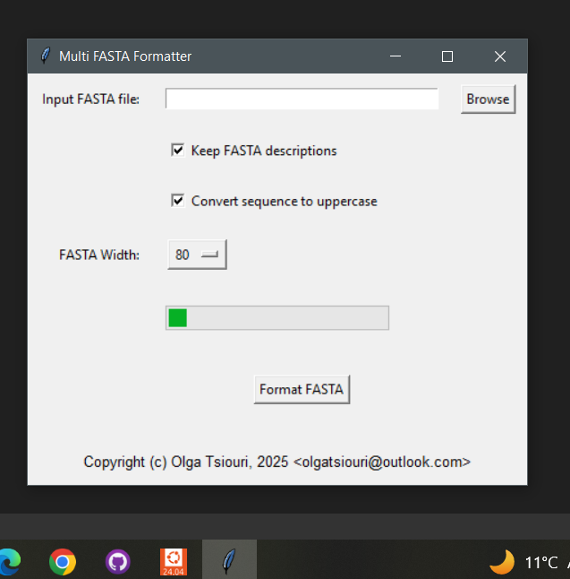

# Multi-FASTA-Formatter

A lightweight fast x86_64 windows gui app to change the format of a Multi-FASTA file

## Usage

1. Install [seqtk](https://github.com/olgatsiouri1996/seqtk)
2. Download the file from the `bin` folder.
3. Click `Browse` to select an input multi-fasta file.
4. Select FASTA width from the dropdown menu.
5. Check whether or not you want to convert sequence letters to uppercase
6. Check whether or not you want to keep FASTA descr
7. Press `Run program` to execute.

## Notes
1. Example input/output files can be seen in the `data` folder.
2. Input file was downloaded from solgenomics.net
